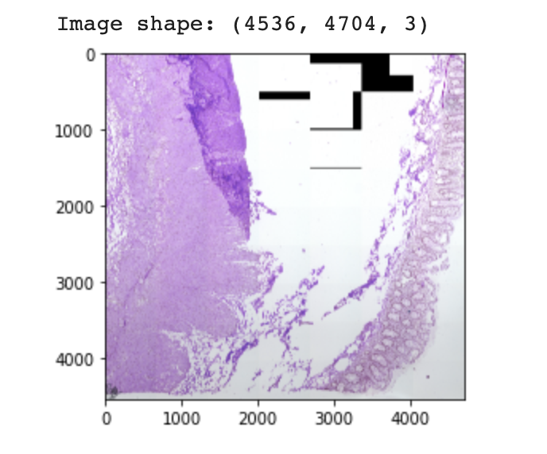
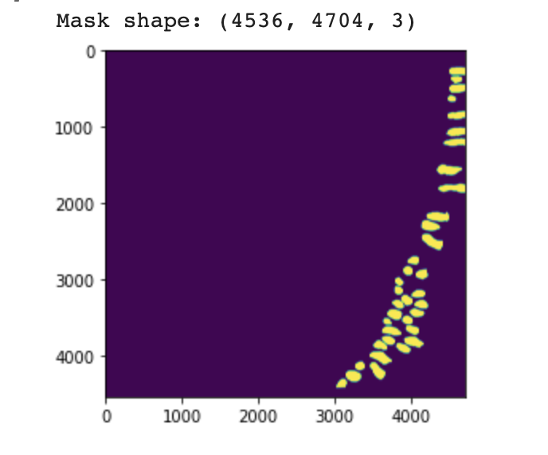

# Colonic-Crypt-Segmentation

Trained a segmentation model UNet using Pytorch to segment the colonic crypts in the tissue images. 
Dataset source: https://drive.google.com/drive/folders/1m-rYzhWbabhVBEMbClq6fRoOpLUgpFnx?usp=sharing

## Data Preprocessing

## Architecture

## Training

## Inference

## Data Visualization

## Insights

## Conclusion

## References

[1] https://github.com/cns-iu/ccf-research-kaggle-2021

[2] 

## Paper 1: Summary
source: https://www.nature.com/articles/s41592-019-0403-1

## Paper 2: Summary
source: https://distill.pub/2019/activation-atlas/
