# Colonic-Crypt-Segmentation

Trained a segmentation model UNet using Pytorch to segment the colonic crypts in the tissue images. 

###### Dataset source: https://drive.google.com/drive/folders/1m-rYzhWbabhVBEMbClq6fRoOpLUgpFnx?usp=sharing

The colon dataset consists of 6 .tiff whole slide images (WSIs) and their GeoJSON annotations of colonic crypts. Each image is from a hematoxylin and eosin (H&E) stained coverslip from different regions of the colon (ascending, transverse, descending, and descending sigmoid). Hematoxylin and eosin stains nucleic acids deep blue-purple and nonspecific proteins varying degrees of pink, respectively. The WSIs were annotated by a pathologist using QuPath, and the resulting annotations were exported to GeoJSON format.

The position and shape of a crypt is represented by a set of pixel coordinates that indicate the outline of a single annotation. Run-length encodings (RLEs, see figure below for example) of the annotations are provided (train.csv and test.csv files), as well as metadata on the images and tissue donors (colon-dataset_information.csv).


## Data Preprocessing
<table>
<tr>
    <td></td>
    <td></td>
    
</tr>
</table>


## Architecture


## Training

## Inference

```bash
# Dice score for test set
            Image                          Score
1 CL_HandE_1234_B004_bottomleft     0.8751588501232356
2 HandE_B005_CL_b_RGB_bottomleft    0.7151214544866026

Average	0.7951401523049191
```
```bash
            Image                          Score
1 CL_HandE_1234_B004_bottomright  0.7902297684303141
2 CL_HandE_1234_B004_topleft	    0.8143473842064496
3 CL_HandE_1234_B004_topright	    0.8089536289263017
4 HandE_B005_CL_b_RGB_bottomright  0.8302962795308487
5 HandE_B005_CL_b_RGB_topleft	    0.8790617750363643

Average	0.8245777672260557
```
## Data Visualization

### PCA

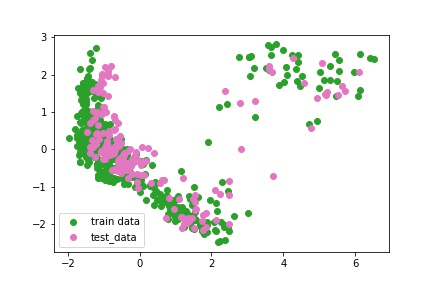
<table>
<tr>
    <td>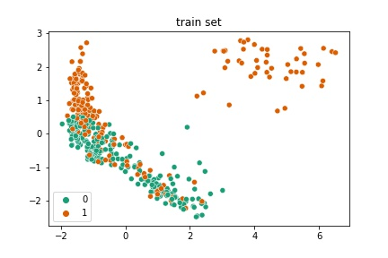</td>
    <td>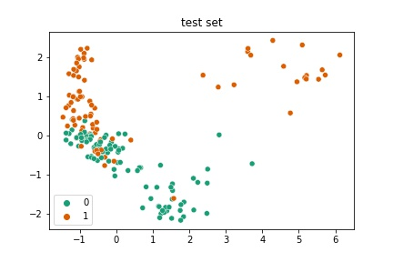</td>
</tr>
</table>

### T-SNE
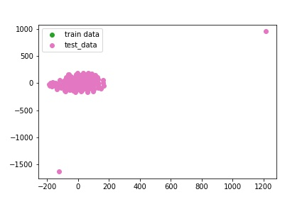
<table>
<tr>
    <td>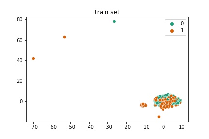</td>
    <td>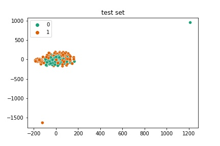</td>
</tr>
</table>
    
### UMAP
    
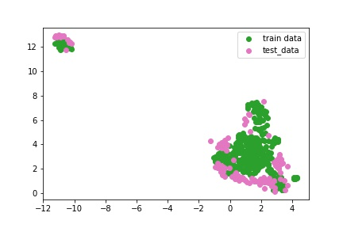
<table>
<tr>
    <td>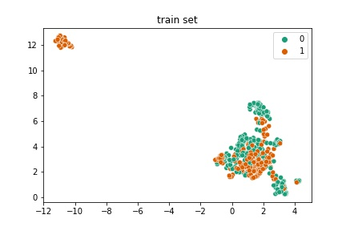</td>
    <td>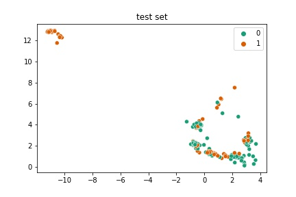</td>
</tr>
</table>

### MDS

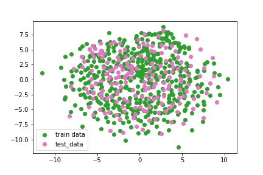
<table>
<tr>
    <td>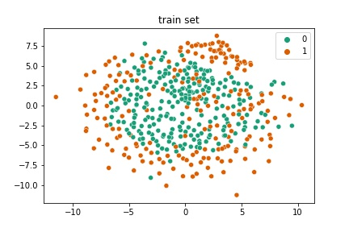</td>
    <td>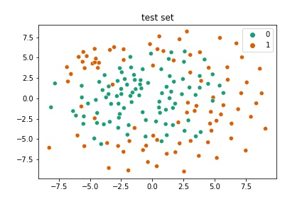</td>
    
</tr>
</table>

## Insights

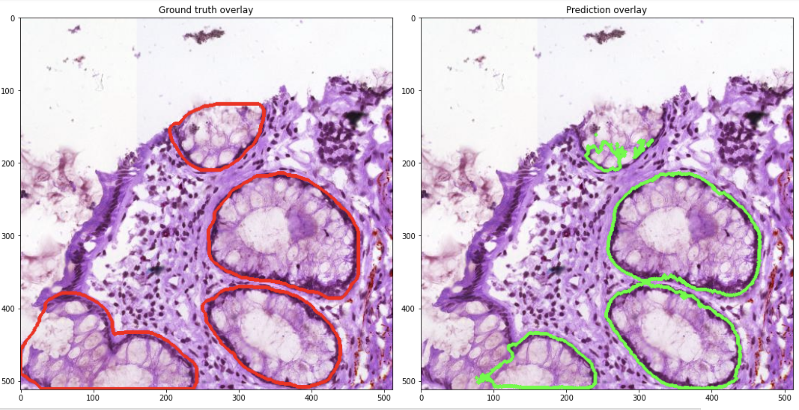

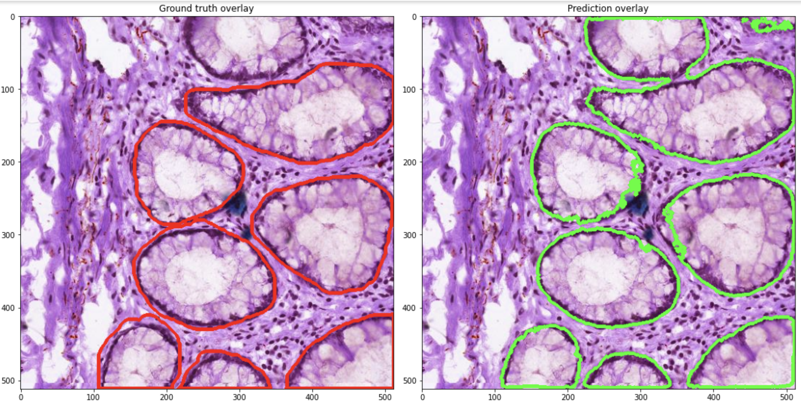
 
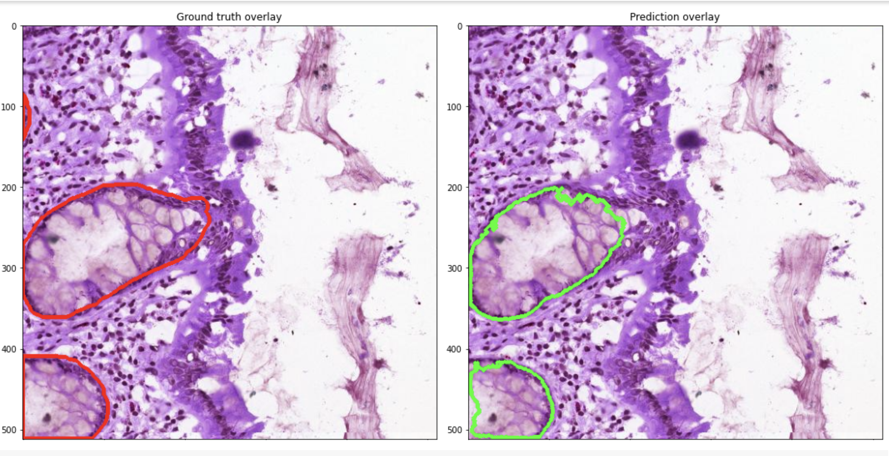


 
## Conclusion

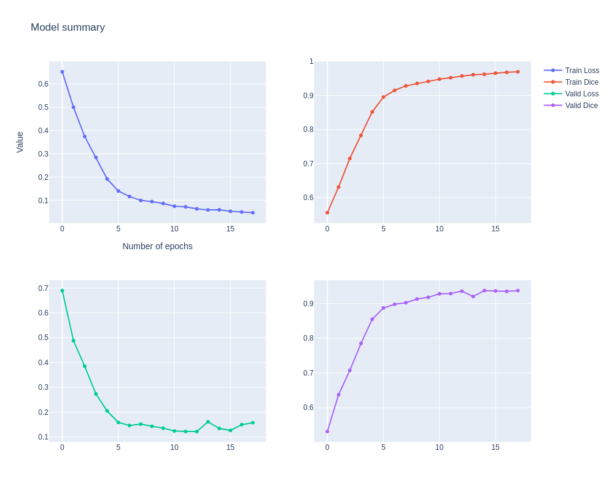

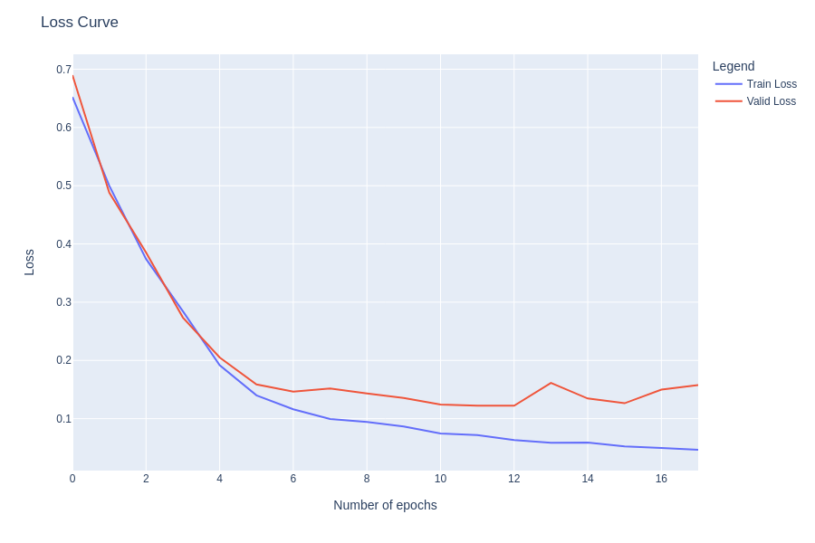

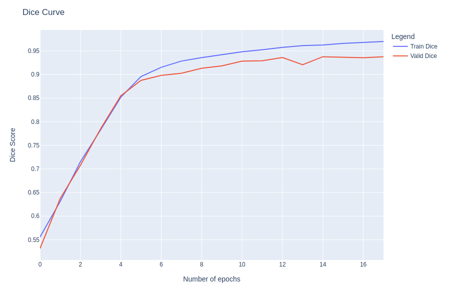

## References

[1] https://github.com/cns-iu/ccf-research-kaggle-2021

[2] 

## Paper 1: Summary
source: https://www.nature.com/articles/s41592-019-0403-1

## Paper 2: Summary
source: https://distill.pub/2019/activation-atlas/
